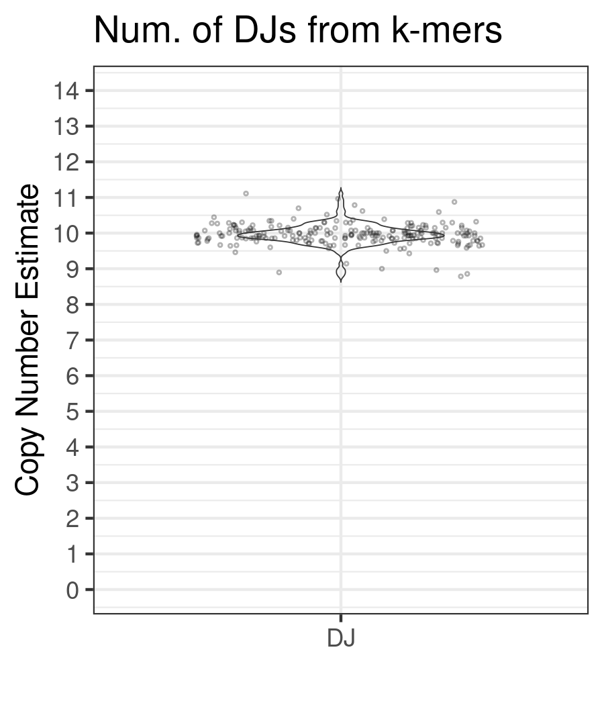
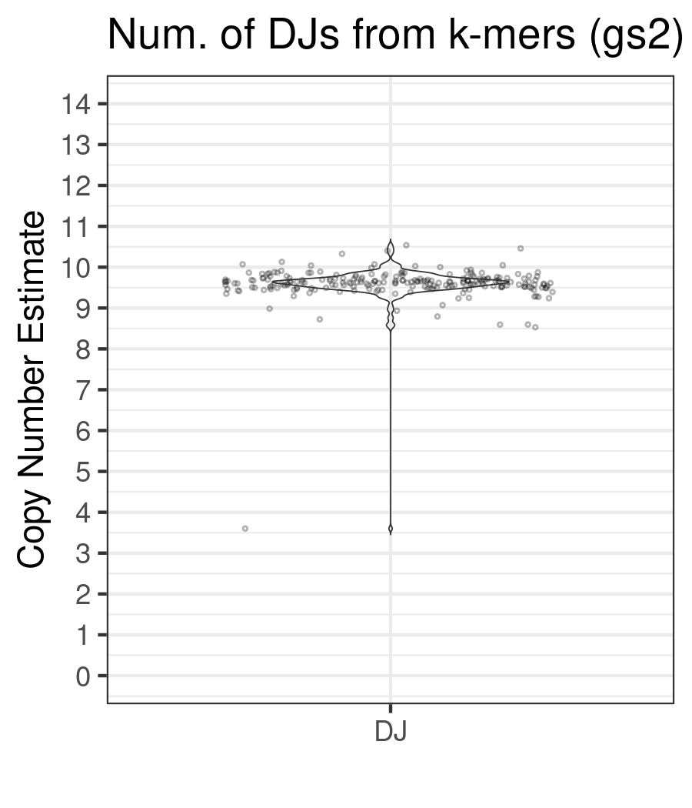

# K-mer based approach

## Dependencies
* [Meryl v1.4.1](https://github.com/marbl/meryl): Recommended to use the pre-built binary release versions. Append the path to the binary `meryl` under $PATH environment variable.
* [Merqury](https://github.com/marbl/merqury): We are only using [kmerHistToPloidyDepth.jar](https://github.com/marbl/merqury/blob/master/eval/kmerHistToPloidyDepth.jar). Clone this repository under `$tools` and set the environment variable `MERQURY=/path/to/tools/Merqury`. Nothing needs to be installed except for a java runtime engine, which comes with most OSs.
* Optional: [Samtools v1.21+](https://github.com/samtools/samtools) if the input file is in BAM/CRAM format

## Prepare DJ target k-mer db
Unzip and untar `DJtarget.meryl.tar.gz` under `resources`:

```sh
cd ../resources
pigz -cd DJtarget.meryl.tar.gz > DJtarget.meryl.tar
tar -xf DJtarget.meryl.tar
```

Check `DJtarget.meryl` matches the following stats:
```sh
meryl statistics DJtarget.meryl | head -n5

Found 1 command tree.
Number of 31-mers that are:
  unique                      0  (exactly one instance of the kmer is in the input)
  distinct                52227  (non-redundant kmer sequences in the input)
  present              26140589  (...)
  missing   4611686018427335677  (non-redundant kmer sequences not in the input)
```

## Fast start
Run `kmer_based_dj_counting.sh`
```sh
./kmer_based_dj_counting.sh
Usage: kmer_based_dj_counting.sh <sample_name> <input.bam|input.fq.gz>
  sample_name: Sample identifier
  input.bam|input.fq.gz: Input sequencing reads in BAM or FASTQ format (gz or not).
  For paired-end reads, provide files as a comma separated list e.g. "input1.fq.gz,input2.fq.gz"
```

## Collect 31-mers

This step counts all 31-mers in the sequence.

Note meryl accepts `${input}` in FASTA or FASTQ format. Retrieve FASTQ files back from BAM/CRAM file if needed.

```sh
meryl count k=31 threads=${cpus} memory=${mem} output ${sample}.k31.meryl ${input}
meryl histogram ${sample}.k31.meryl > ${sample}.k31.hist
```

## Collect median peak for DJ k-mers
The `$DJ_TARGET` has been carefully chosen based on kmer profiles on CHM13. The intersection below outputs a subset of the k-mers found in the reads. The histogram is used to pick up the median frequency and its corresponding k-mer multiplicity. This matches the mostly observed k-mer counts found in the DJ.

```sh
meryl intersect threads=${cpus} memory=${mem} ${sample}.k31.meryl $DJ_TARGET output ${sample}.DJ.meryl
meryl histogram ${sample}.DJ.meryl > ${sample}.DJ.hist
count_mid=`cat ${sample}.DJ.hist | awk '{ count+=$NF; } END {print count/2}'`
med=`cat ${sample}.DJ.hist | \
  awk -v count_mid=${count_mid} '{cnt_sum+=$NF; if (cnt_sum > count_mid) {print $(NF-1); exit;} }'`
```

## Collect background coverage (2-copy peak)

Background coverage is using `kmerHistToPloidyDepth.jar` from Merqury, which differentiates the histogram to find the 1- and 2-copy peaks and boundaries. In some corner cases it fails to find the 1st peak and only reports the 2nd peak as the 1st peak, which is observed in very homozygous samples. Regardless, the last line peak value corresponds to the most likely observed 2-copy peak.

```sh
peak2=`java -jar -Xmx256m $MERQURY/eval/kmerHistToPloidyDepth.jar ${sample}.k31.hist | tail -n1 | awk '{print $2}'`
```

## DJ copy number estimate
Now we are simply deviding the observed median peak of the DJ counts by the background coverage. Because we are using the 2-copy peak, we adjust the values (by `medx2`) to output the report in absolute copies.

```sh
# print Sample, DJmedCov, PeakCP2, Peak_Est
echo -e "${sample}\t${med}\t${peak2}" |
  awk -F "\t" '{print $1"\t"$2"\t"$3"\t"(($2*2)/$3)}' \
  > ${sample}_DJ_count.txt
```

## Gather results
Collect results in one place and sort by copy number estimates.
```sh
echo -e "Sample\tDJmedCov\tPeakCP2\tPeak_Est" > djcount_kmer.txt
cat *_DJ_count.txt | sort -k4,4n >> djcount_kmer.txt
```
Below is the result from 222 1KGP samples with available assemblies and sequenced with Illumina NovaSeq at NYGC.
Estimates using the 2cp peak (`Peak_Est`) seems more reliable.



## Experimenting with genomescope2
As an option, GenomeScope2 `kcov` can be used for collecting the background coverage. However, we found that using the actual peak value of the 2-copy region fitted better to the expected distribution.

```sh
mkdir -p genomescope2
Rscript $tools/genomescope2.0/genomescope.R -i ${sample}.k31.hist -o genomescope2/${sample} --fitted_hist -k 31

# Extract kmercov and 95% CI for the kmercov from GenomeScope2 model.txt
#   $2 = kcov, $3 = margin error
# print Sample, DJmedCov, PeakCP2, Peak_Est, GS2_kcov, GS2_Est, GS2_95CI(lower95CI,upper95CI)
cat genomescope2/$sample/model.txt | grep kmercov | tail -n1 | \
  awk '{print 1*$2"\t("$2-1.96*$3", "$2+1.96*$3")\t"1.96*$3}' | \
  awk -F "\t" -v sample=${sample} -v peak2=${peak2} -v med=${med} \
  '{print sample"\t"med"\t"peak2"\t"((med*2)/peak2)"\t"$1"\t"(med/$1)"\t95%CI("med/($1+$3)","med/($1-$3)")"}' \
  > ${sample}_DJ_count.wiCI.txt
```

